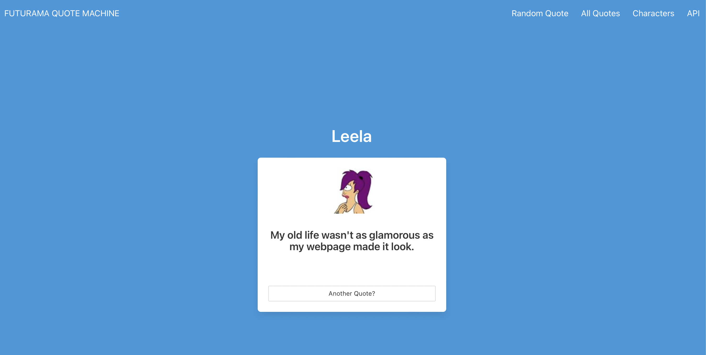
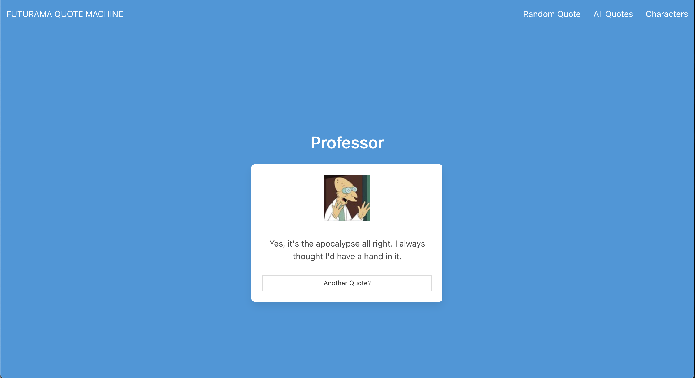
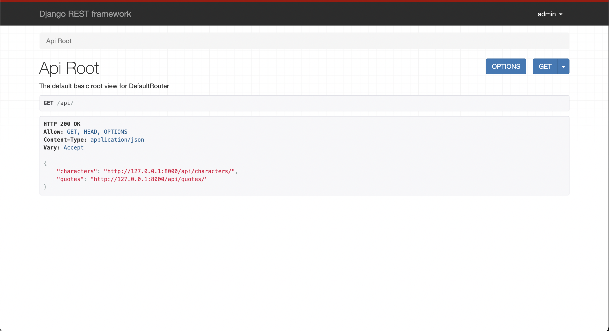

# Django Futurama Quote Machine

A Django App that returns Futurama quotes

***** ARCHIVED REPO *****

### Get it

Clone the repo

    git clone https://github.com/BitsofJeremy/django_futurama_quote_machine.git

Setup you virtualenv and activate it

    virtualenv -p python3 venv
    source venv/bin/activate

Install requirements

    pip install -r requirements.txt

Copy and Source an environment variable file [edit to your liking]

    cp env-example .env
    source .env

Create you SQLite DB

    python manage.py migrate

Create an admin

    python manage.py createsuperuser

Run the server

    python manage.py runserver

Add the base quotes in a different terminal

    python add_quotes.py

Open http://127.0.0.1:8000

Enjoy a nice quote!

#### App Screenshot

### API

Basic routes setup in the API

http://127.0.0.1:8000/api

#### API Screenshot

